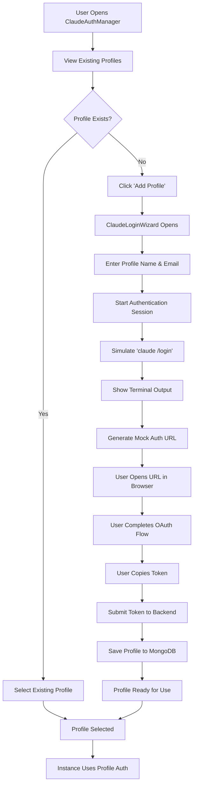

# Claude Multi-User Authentication System

## Overview

The Claude Multi-User Authentication System allows multiple users to authenticate with their individual Claude Max Plan accounts and manage separate authentication profiles within the same Claude Workflow Manager deployment.

## Architecture

### 1. **Data Models**

#### ClaudeAuthProfile
```python
class ClaudeAuthProfile(BaseModel):
    id: str                          # Unique profile ID
    profile_name: str               # User-friendly name
    user_email: Optional[str]       # Associated email
    credentials_json: str           # Encrypted ~/.claude/credentials.json
    project_files: Dict[str, str]   # ~/.claude/projects/* files (base64)
    created_at: datetime           # Creation timestamp
    updated_at: datetime           # Last update timestamp
    last_used_at: Optional[datetime] # Last usage timestamp
    is_active: bool                # Soft delete flag
    claude_version: Optional[str]   # Claude CLI version
    auth_method: str               # "max-plan" or "api-key"
```

### 2. **Storage Strategy**

- **MongoDB Collection**: `claude_auth_profiles`
- **File Security**: Credentials stored as base64-encoded JSON
- **Isolation**: Each profile maintains separate authentication state
- **Persistence**: Files restored to filesystem on-demand per instance

### 3. **Authentication Flow**



## Components

### 1. **Frontend Components**

#### ClaudeLoginWizard.tsx
- **Purpose**: Interactive terminal-like UI for Claude authentication
- **Features**:
  - Step-by-step wizard interface
  - Simulated terminal output
  - OAuth URL generation and opening
  - Token submission and validation
  - Real-time status updates

#### ClaudeAuthManager.tsx
- **Purpose**: Manage multiple Claude authentication profiles
- **Features**:
  - List all authentication profiles
  - Create new profiles via ClaudeLoginWizard
  - Select/switch between profiles
  - Profile metadata display (last used, email, etc.)
  - Delete/deactivate profiles

### 2. **Backend Components**

#### Claude File Manager (claude_file_manager.py)
- **Purpose**: Handle `.claude` file restoration and backup
- **Key Methods**:
  - `restore_claude_files()`: Restore auth files from MongoDB to filesystem
  - `backup_claude_files()`: Backup auth files from filesystem to MongoDB
  - `create_isolated_claude_env()`: Create isolated environment per instance
  - `cleanup_isolated_env()`: Clean up temporary environments

#### API Endpoints
- `GET /api/claude-auth/profiles`: List all authentication profiles
- `POST /api/claude-auth/login-session`: Start interactive login session
- `POST /api/claude-auth/submit-token`: Submit OAuth token and create profile

## Usage Examples

### 1. **Creating a New Profile**

```typescript
// Frontend: Open ClaudeAuthManager
const [showAuthManager, setShowAuthManager] = useState(false);

// User clicks "Add Profile" -> ClaudeLoginWizard opens
// User follows wizard steps:
// 1. Enter profile name: "John's Work Account"
// 2. Enter email: "john@company.com"
// 3. Complete OAuth flow
// 4. Submit token
// 5. Profile saved to MongoDB
```

### 2. **Using Profile for Instance**

```python
# Backend: Restore auth files before spawning instance
profile_id = "user-selected-profile-id"
claude_env_path = await claude_file_manager.create_isolated_claude_env(profile_id)

# Spawn Claude instance with restored auth
instance_info = {
    "claude_env_path": claude_env_path,
    "profile_id": profile_id,
    # ... other instance data
}

# Clean up after instance completes
await claude_file_manager.cleanup_isolated_env(claude_env_path)
```

### 3. **Environment Variables for Instance**

```bash
# Set HOME to isolated directory for Claude CLI
export HOME="/tmp/claude-abc12345/.claude"
export CLAUDE_CONFIG_DIR="/tmp/claude-abc12345/.claude"

# Run Claude CLI with restored authentication
claude --session-id "instance-session-id" "user command"
```

## Security Considerations

### 1. **Credential Storage**
- **Encryption**: All credentials stored as base64-encoded JSON
- **Access Control**: Only backend can access raw credentials
- **No Frontend Exposure**: Frontend never sees actual auth tokens

### 2. **Isolation**
- **Per-Instance Environments**: Each instance gets isolated `.claude` directory
- **Temporary Files**: Isolated environments cleaned up after use
- **Process Separation**: Each profile's auth is process-isolated

### 3. **Audit Trail**
- **Usage Tracking**: `last_used_at` timestamp for each profile
- **Activity Logs**: All authentication activities logged
- **Profile Management**: Soft delete maintains audit history

## Multi-Tenant Scenarios

### 1. **Team Workspaces**
```
Team A:
├── alice@teama.com (Profile: "Alice - Team A")
├── bob@teama.com   (Profile: "Bob - Team A") 
└── shared@teama.com (Profile: "Team A Shared")

Team B:
├── carol@teamb.com (Profile: "Carol - Team B")
└── shared@teamb.com (Profile: "Team B Shared")
```

### 2. **Individual Users with Multiple Accounts**
```
John Smith:
├── john.personal@gmail.com    (Profile: "Personal")
├── john.work@company.com      (Profile: "Work")
└── john.consulting@freelance.com (Profile: "Consulting")
```

## Configuration

### 1. **Environment Variables**
```bash
# Default behavior (can be overridden per instance)
USE_CLAUDE_MAX_PLAN=true

# MongoDB settings for profile storage
MONGO_INITDB_ROOT_USERNAME=username
MONGO_INITDB_ROOT_PASSWORD=password
```

### 2. **Per-Instance Profile Selection**
```typescript
interface SpawnInstanceRequest {
  workflow_id: string;
  prompt_id?: string;
  claude_profile_id?: string;  // Optional: specific profile to use
  // ... other fields
}
```

## Troubleshooting

### 1. **Authentication Failures**
- **Check Profile Status**: Ensure profile `is_active: true`
- **Verify Credentials**: Check if stored credentials are valid
- **Check File Restoration**: Verify `.claude` files restored correctly

### 2. **Profile Issues**
- **Duplicate Names**: System allows duplicate names (uses unique IDs)
- **Missing Files**: Some profiles may have incomplete file sets
- **Expired Tokens**: OAuth tokens may expire and need refresh

### 3. **Performance Considerations**
- **File Restoration Time**: Large project files may slow instance startup
- **Cleanup**: Ensure isolated environments are properly cleaned up
- **Database Load**: Monitor MongoDB performance with many profiles

## Future Enhancements

### 1. **Advanced Features**
- **Profile Sharing**: Allow profiles to be shared between users
- **Automatic Refresh**: Auto-refresh expired OAuth tokens
- **Profile Templates**: Create profile templates for common setups

### 2. **Enterprise Features**
- **SSO Integration**: Single Sign-On with corporate directories
- **Access Controls**: Role-based access to specific profiles
- **Audit Logging**: Comprehensive audit logs for compliance

### 3. **UI Improvements**
- **Profile Import/Export**: Backup and restore profiles
- **Bulk Operations**: Manage multiple profiles simultaneously
- **Usage Analytics**: Show profile usage statistics

## API Reference

### List Profiles
```http
GET /api/claude-auth/profiles
Response: {
  "profiles": [
    {
      "id": "prof_123",
      "profile_name": "John's Account", 
      "user_email": "john@example.com",
      "created_at": "2023-12-01T10:00:00Z",
      "last_used_at": "2023-12-01T15:30:00Z",
      "auth_method": "max-plan"
    }
  ]
}
```

### Start Login Session
```http
POST /api/claude-auth/login-session
Body: {
  "profile_name": "New Profile",
  "user_email": "user@example.com"
}
Response: {
  "session_id": "sess_abc123",
  "profile_name": "New Profile",
  "message": "Login session started"
}
```

### Submit Auth Token
```http
POST /api/claude-auth/submit-token
Body: {
  "session_id": "sess_abc123",
  "auth_token": "oauth_token_here"
}
Response: {
  "success": true,
  "profile_id": "prof_456",
  "message": "Profile created successfully"
}
```

This system provides a comprehensive solution for managing multiple Claude Max Plan accounts within a single deployment, enabling teams and individuals to use their own authentication while sharing the same infrastructure.
